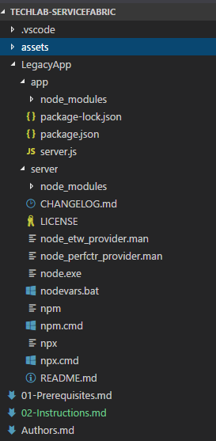
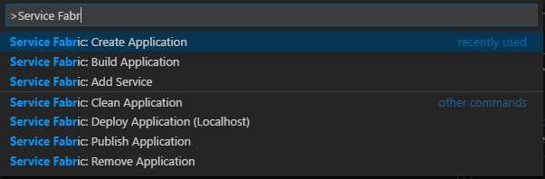
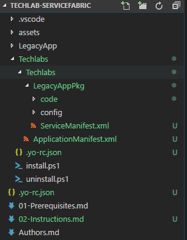
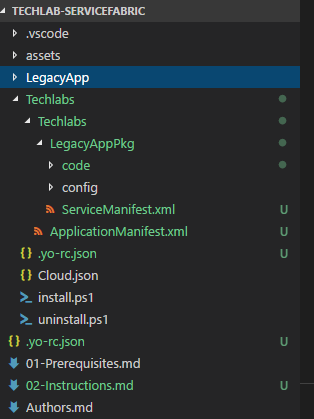
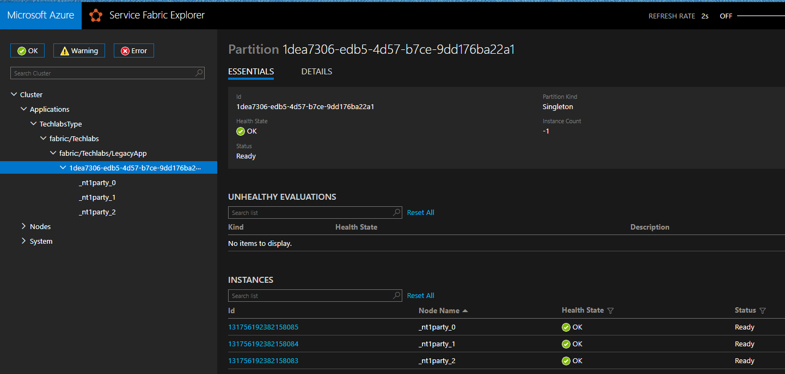

# Instructions

La liste des raccourcis VS Code est disponible pour : [https://code.visualstudio.com/shortcuts/keyboard-shortcuts-macos.pdf](MacOS) / [https://code.visualstudio.com/shortcuts/keyboard-shortcuts-windows.pdf](Windows)

## Récupérer la solution via Github

Il est possible de download la solution depuis Github, ou de faire un git clone

```bash
git clone https://github.com/SoatGroup/techlab-servicefabric.git
```

## Ouvrir le dossier dans VS Code

Contenu de la solution



La solution contient un dossier **LegacyApp** qui contient 2 sous-dossiers qui sont :
* **app** : qui contient le contenu de notre application
* **server** : qui contient la distribution de node.js pour Windows

Notre application node.js consite à exécuter ce code : 

```js
var express = require('express')
var feed = require('feed-read')

var url = "http://blog.soat.fr/feed/";

var port = process.env.port || 1337
var app = express(); 

app.get('/', function (req, res){
    res.writeHead(200, { 'Content-Type': 'application/json' });

    var feeder = new Promise(function(resolve, reject){
        feed(url, function (err, articles){
            if (err) {
                reject(err);
            } else {
                result = [];
                for (var i = 0; i < articles.length; i++) {
                    result.push( { title: articles[i].title, url: articles[i].url, author: articles[i].author, date: articles[i].published });
                }
                resolve(result);
            }
        });
    }).then(function (result) {
        res.write(JSON.stringify(result));
        res.end();
    });

    

});

app.listen(port);
```

## Exécuter l'application en local

Dans le terminal de VSCode, tapez la commande suivante : 

```powershell
.\LegacyApp\server\node.exe .\LegacyApp\app\server.js
```

Ouvrez votre navigateur favori à l'url : [http://localhost:1337](http://localhost:1337)

## Packager la solution pour Service Fabric

### Générer le package initial 

Lancer la commande **Service Fabric : Create Application**



Renseignez les paramètres suivants : 
* Application Template : **azuresfguest**
* Name of your application : **Techlabs**
* Name of the application service : **LegacyApp**
* Source folder of guest binary artifacts : **LegacyApp**
* Relative path to guest binary in source folder : **server/node.exe**
* Parameters to use when calling guest binary : **app/server.js**
* Number of instances of guest binary: **-1**

Le workspace Visual Studio Code ressemble maintenant à cela :



### Exposer l'application 

Dans le fichier **ServiceManifest.xml**, ajouter la variable d'environnement pour configurer le port, ainsi que l'endpoint http pour que l'application soit accessible : 

```xml
    <CodePackage Name="code" Version="1.0.0">
        <EntryPoint>
            <ExeHost>
                <Program>server\node.exe</Program>
                <Arguments>app\server.js</Arguments>
                <WorkingFolder>CodePackage</WorkingFolder>
            </ExeHost>
        </EntryPoint>
        <!-- ADD ENVIRONMENT VARIABLE -->
        <EnvironmentVariables>
            <EnvironmentVariable Name="PORT" Value="8080" />
        </EnvironmentVariables>
    </CodePackage>
    <!-- ADD ENDPOINT -->
    <Resources>
        <Endpoints>
            <Endpoint Name="NodeAppTypeEndpoint" Protocol="http" Port="8080" UriScheme="http" Type="Input" />
        </Endpoints>
    </Resources>
```

### Compiler l'application 

Utiliser la commande **Service Fabric: Build application** qui nous génère les fichiers **Cloud.json**, **install.ps1** et **uninstall.ps1**



## Déployer l'application 

### Créer un party cluster

Comment créer un party cluster : [http://mfery.com/blog/start-service-fabric-with-party-cluster/](http://mfery.com/blog/start-service-fabric-with-party-cluster/)

Récapitulatif de la création : 

* Se rendre sur l'url [https://try.servicefabric.azure.com/](https://try.servicefabric.azure.com/)
* Créer un compte via Github (ou Facebook)
* Créer un cluster **windows**
* Récupérer et installer le PFX dans CurrentUser\My
    * Le mot de passe se trouve dans le ReadMe
* Récupérer le thumbprint via la MMC ou via Powershell
```powershell
$url = "win243b7e6lxip.westus.cloudapp.azure.com"
$cert = Get-ChildItem -Path Cert:\CurrentUser\My | Where-Object {$_.Subject -eq "cn=$url"} 
$cert.Thumbprint | Clip
```

### Script de déploiement

Créer un fichier **deploy.ps1**, et y ajouter le code suivant (en fonction de votre party cluster)

```powershell
$url = "win243b7e6lxip.westus.cloudapp.azure.com"
$cert = Get-ChildItem -Path Cert:\CurrentUser\My | Where-Object {$_.Subject -eq "cn=$url"} 
Connect-ServiceFabricCluster -ConnectionEndpoint "$($url):19000" -KeepAliveIntervalInSec 10 -X509Credential -ServerCertThumbprint $cert.Thumbprint -FindType 'FindByThumbprint' -FindValue $cert.Thumbprint -StoreLocation 'CurrentUser' -StoreName 'My' -Verbose


$AppPath = ".\Techlabs\Techlabs"
Copy-ServiceFabricApplicationPackage -ApplicationPackagePath $AppPath -ApplicationPackagePathInImageStore Techlabs -CompressPackage
Register-ServiceFabricApplicationType Techlabs
New-ServiceFabricApplication fabric:/Techlabs TechlabsType 1.0.0
```

### Vérifier votre déploiement

*Le déploiement peut prendre quelques minutes*

Allez sur l'url [https://win243b7e6lxip.westus.cloudapp.azure.com:19080/Explorer/index.html](https://win243b7e6lxip.westus.cloudapp.azure.com:19080/Explorer/index.html) (en fonction de votre cluter) afin que votre déploiement soit similaire à celui-ci : 



Il est possible de voir le résultat de votre application sur le site : 
[http://win243b7e6lxip.westus.cloudapp.azure.com:8080](http://win243b7e6lxip.westus.cloudapp.azure.com:8080) 

